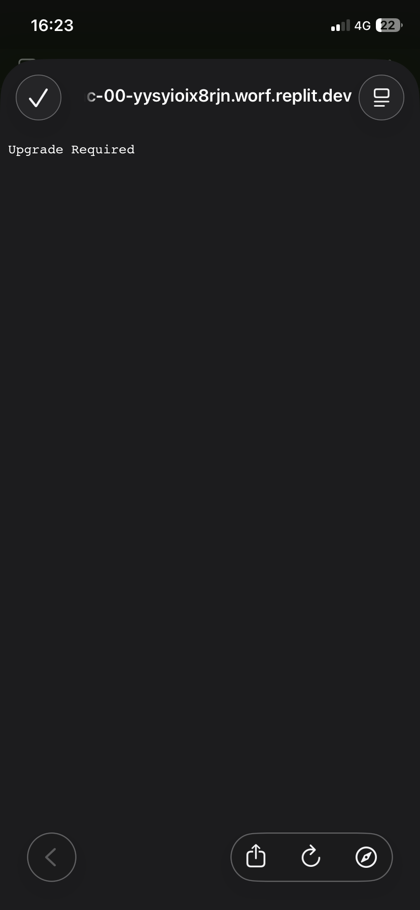

<div align="center">



# ✦ LuminaOS ✦

<p>
  
  
  
  
</p>

<p><em>Ton tableau de bord personnel — maison connectée, IA locale, monitoring serveur, et productivité, au même endroit.</em></p>

</div>

---

## 🚀 Lancement

```bash
npm install
npm run dev
```

> L'application tourne sur **[http://localhost:5000](http://localhost:5000)**

---

## 🔐 Connexion par défaut

| Champ | Valeur |
|:---:|:---:|
| 👤 Utilisateur | `Mat` |
| 🔒 Mot de passe | `211008` |

---

## 🧩 Fonctionnalités

| Module | Description |
|---|---|
| 🏠 **Dashboard** | Horloge, météo, Google, actualités, Spotify, notes, todo |
| 🤖 **Lumy** | IA personnelle 100% locale — zéro API, zéro cloud |
| 💡 **Maison** | Contrôle des appareils Google Home |
| 🖥️ **Serveur** | Monitoring ZimaOS (CPU, RAM, stockage, uptime) |
| ⏱️ **Pomodoro** | Focus timer avec compteur de sessions |
| ✅ **Habitudes** | Suivi quotidien, streaks, progression |
| 🧮 **Calculette** | Calculs rapides intégrés |
| 🔧 **Outils** | Générateur mdp, base64, convertisseurs |
| ⚙️ **Paramètres** | Comptes, Discord bot, Spotify |

---

## 🌐 Variables d'environnement

Créez un `.env` à la racine pour activer les intégrations optionnelles :

```env
# 🎵 Spotify
SPOTIFY_CLIENT_ID=
SPOTIFY_CLIENT_SECRET=
SPOTIFY_REDIRECT_URI=http://localhost:5000/api/spotify/callback

# 🤖 Gemini (optionnel, Lumy fonctionne sans)
GEMINI_API_KEY=
```

---

## 🛠️ Stack technique

```
Frontend  →  React 19 + TypeScript + Vite + Tailwind CSS v4
Backend   →  Express.js + tsx
Animations →  Motion (Framer Motion)
Stockage  →  lumina_db.json  (pas de base externe)
IA (Lumy) →  Moteur local — 0 API externe
```

---

<div align="center">

**✦ Fait avec intention ✦**

</div>
